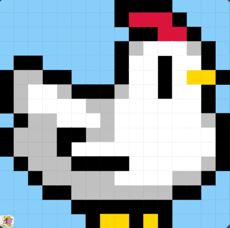

# Unit 1 - Asphalt Art

## Introduction

Cities use asphalt art to improve public safety, inspire their residents and visitors, and brighten communities. Your goal is to create asphalt art to revitalize The Neighborhood and bring the community together with the help of the Painter.

## Requirements

Use your knowledge of object-oriented programming, algorithms, the problem solving process, and decomposition strategies to create asphalt art:
- **Create a new subclass** – Create at least one new subclass of the PainterPlus class that is used for a component of the asphalt art design.
- **Plan an algorithm** – Use the problem solving process and decomposition strategies to plan an algorithm that incorporates a combination of sequencing, selection, and/or iteration.
- **Write a method** – Write at least one method in a PainterPlus subclass that contributes to a component of the asphalt art design.
- **Document your code** – Use comments to explain the purpose of the methods and code segments.

## Notes: Neighborhood & Painter Class

This project was created on Code.org's JavaLab platform using the built-in Neighborhood GUI output. To test and edit this project you must build in Code.org's JavaLab with the Neighborhood GUI enabled. For reference to the Painter class documentation, [you can read more here.](https://studio.code.org/docs/ide/javalab/classes/Painter)

## Output:

## Reflection

1. Describe your project.

   - My asphalt art project is a digital 16 x 16 pixel chicken. It is just a general image of a white chicken with yellow feet and a red comb.

2. What are two things about your project that you are proud of?

   - When I created this project, I was really proud of my attention to detail with little attributes like the grey shadows. I spent a lot of time with the decomposition aspect of the project, as I broke up each painting task into many different subclasses.

3. Describe something you would improve or do differently if you had an opportunity to change something about your project.

   - If I had an opportunity to do this project again, I would most likely spend less time breaking up the painting jobs into multiple subclasses. Although I am proud of how I thoroughly organized each painting task, I think I spent too much time on it and was not very efficient.